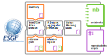
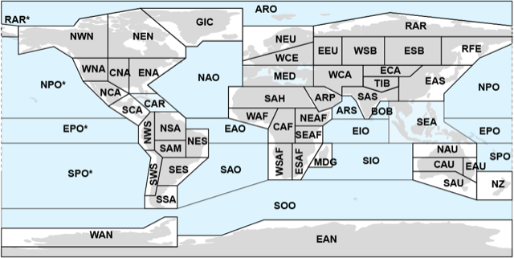

(intro)=

[](https://doi.org/10.5281/zenodo.3691645)
[![MyBinder badge](https://img.shields.io/badge/Launch%20in%20MyBinder-IPCC%20WGI%20AR6%20Atlas%20execution%20environment%20-E66581.svg?logo=data:image/png;base64,iVBORw0KGgoAAAANSUhEUgAAAFkAAABZCAMAAABi1XidAAAB8lBMVEX///9XmsrmZYH1olJXmsr1olJXmsrmZYH1olJXmsr1olJXmsrmZYH1olL1olJXmsr1olJXmsrmZYH1olL1olJXmsrmZYH1olJXmsr1olL1olJXmsrmZYH1olL1olJXmsrmZYH1olL1olL0nFf1olJXmsrmZYH1olJXmsq8dZb1olJXmsrmZYH1olJXmspXmspXmsr1olL1olJXmsrmZYH1olJXmsr1olL1olJXmsrmZYH1olL1olLeaIVXmsrmZYH1olL1olL1olJXmsrmZYH1olLna31Xmsr1olJXmsr1olJXmsrmZYH1olLqoVr1olJXmsr1olJXmsrmZYH1olL1olKkfaPobXvviGabgadXmsqThKuofKHmZ4Dobnr1olJXmsr1olJXmspXmsr1olJXmsrfZ4TuhWn1olL1olJXmsqBi7X1olJXmspZmslbmMhbmsdemsVfl8ZgmsNim8Jpk8F0m7R4m7F5nLB6jbh7jbiDirOEibOGnKaMhq+PnaCVg6qWg6qegKaff6WhnpKofKGtnomxeZy3noG6dZi+n3vCcpPDcpPGn3bLb4/Mb47UbIrVa4rYoGjdaIbeaIXhoWHmZYHobXvpcHjqdHXreHLroVrsfG/uhGnuh2bwj2Hxk17yl1vzmljzm1j0nlX1olL3AJXWAAAAbXRSTlMAEBAQHx8gICAuLjAwMDw9PUBAQEpQUFBXV1hgYGBkcHBwcXl8gICAgoiIkJCQlJicnJ2goKCmqK+wsLC4usDAwMjP0NDQ1NbW3Nzg4ODi5+3v8PDw8/T09PX29vb39/f5+fr7+/z8/Pz9/v7+zczCxgAABC5JREFUeAHN1ul3k0UUBvCb1CTVpmpaitAGSLSpSuKCLWpbTKNJFGlcSMAFF63iUmRccNG6gLbuxkXU66JAUef/9LSpmXnyLr3T5AO/rzl5zj137p136BISy44fKJXuGN/d19PUfYeO67Znqtf2KH33Id1psXoFdW30sPZ1sMvs2D060AHqws4FHeJojLZqnw53cmfvg+XR8mC0OEjuxrXEkX5ydeVJLVIlV0e10PXk5k7dYeHu7Cj1j+49uKg7uLU61tGLw1lq27ugQYlclHC4bgv7VQ+TAyj5Zc/UjsPvs1sd5cWryWObtvWT2EPa4rtnWW3JkpjggEpbOsPr7F7EyNewtpBIslA7p43HCsnwooXTEc3UmPmCNn5lrqTJxy6nRmcavGZVt/3Da2pD5NHvsOHJCrdc1G2r3DITpU7yic7w/7Rxnjc0kt5GC4djiv2Sz3Fb2iEZg41/ddsFDoyuYrIkmFehz0HR2thPgQqMyQYb2OtB0WxsZ3BeG3+wpRb1vzl2UYBog8FfGhttFKjtAclnZYrRo9ryG9uG/FZQU4AEg8ZE9LjGMzTmqKXPLnlWVnIlQQTvxJf8ip7VgjZjyVPrjw1te5otM7RmP7xm+sK2Gv9I8Gi++BRbEkR9EBw8zRUcKxwp73xkaLiqQb+kGduJTNHG72zcW9LoJgqQxpP3/Tj//c3yB0tqzaml05/+orHLksVO+95kX7/7qgJvnjlrfr2Ggsyx0eoy9uPzN5SPd86aXggOsEKW2Prz7du3VID3/tzs/sSRs2w7ovVHKtjrX2pd7ZMlTxAYfBAL9jiDwfLkq55Tm7ifhMlTGPyCAs7RFRhn47JnlcB9RM5T97ASuZXIcVNuUDIndpDbdsfrqsOppeXl5Y+XVKdjFCTh+zGaVuj0d9zy05PPK3QzBamxdwtTCrzyg/2Rvf2EstUjordGwa/kx9mSJLr8mLLtCW8HHGJc2R5hS219IiF6PnTusOqcMl57gm0Z8kanKMAQg0qSyuZfn7zItsbGyO9QlnxY0eCuD1XL2ys/MsrQhltE7Ug0uFOzufJFE2PxBo/YAx8XPPdDwWN0MrDRYIZF0mSMKCNHgaIVFoBbNoLJ7tEQDKxGF0kcLQimojCZopv0OkNOyWCCg9XMVAi7ARJzQdM2QUh0gmBozjc3Skg6dSBRqDGYSUOu66Zg+I2fNZs/M3/f/Grl/XnyF1Gw3VKCez0PN5IUfFLqvgUN4C0qNqYs5YhPL+aVZYDE4IpUk57oSFnJm4FyCqqOE0jhY2SMyLFoo56zyo6becOS5UVDdj7Vih0zp+tcMhwRpBeLyqtIjlJKAIZSbI8SGSF3k0pA3mR5tHuwPFoa7N7reoq2bqCsAk1HqCu5uvI1n6JuRXI+S1Mco54YmYTwcn6Aeic+kssXi8XpXC4V3t7/ADuTNKaQJdScAAAAAElFTkSuQmCC)](https://mybinder.org/v2/gh/SantanderMetGroup/binder-atlas/master?urlpath=git-pull%3Frepo%3Dhttps%253A%252F%252Fgithub.com%252FIPCC-WG1%252FAtlas%26urlpath%3Dlab%252Ftree%252FAtlas%252F%26branch%3Dmain)

# Repository supporting the implementation of FAIR principles in the IPCC-WGI Atlas

The *WGI Atlas* is part of the AR6 report and provides a region-by-region assessment of climate change including also an innovative online tool (the *Interactive Atlas*, {cite}`atlas-ipcc-web` that complements the report {cite}`atlas-ipcc` by providing flexible spatial and temporal analyses of regional climate change by means of two components (see AR6 Atlas chapter, Sections 1 and 2). The **regional information** component allows for flexible analysis of past and projected changes for over 25 variables and derived indices calculated from key climate datasets supporting the assessment done in the Chapters. The **regional synthesis** component provides flexible anlysis of synthesis assessments over a new set of sub-continental reference regions supporting the Technical Summary and Summary for Policymakers. A description of the datasets

The IPCC AR6 WGI report promotes best practices in traceability and reproducibility, including through adoption of the Findable, Accessible, Interoperable, and Reusable (FAIR) principles for scientific data. In particular, reproducibility and reusability are central in order to ensure the transparency of the products, which are all publicly available. The Atlas products are generated using **free software community tools**, in particular *R* {cite:authorpar}`R` building on the *climate4R* {cite}`climate4r`framework for data post-processing (data access, regridding, aggregation, bias adjustment, etc.) and evaluation and quality control (when applicable). **Provenance metadata** is generated for the Interactive Atlas using the *METACLIP* {cite:authorpar}`metaclip` RDF-based framework, extended to cover the products delivered by the IPCC-AR6 Interactive Atlas {cite:authorpar}`metaclip-atlas`.


## Contents

This repository provides the scripts and notebooks, as well as the required auxiliary products and datasets, supporting the reproducilibility and reusability of some of the Atlas products (mainly key figures in the Chapter and data-driven products of the Interactive Atlas – regional information component), as described in the following schema and table of contents.



| Directory | Contents |
| :-------- | :------- |
| [data-sources](data-sources) | Full list of model simulations used for the different experiments and scenarios, indicating the availability of the different variables
| [reference-grids](reference-grids) | Reference commensurable grids at regular 0.5&deg;, 1&deg; and 2&deg; resolutions. These are used to interpolate all variables and indices as a final processing step before analysis.
| [datasets-interactive-atlas](datasets-interactive-atlas) |  End-to-end scripts used for the preparation of the intermediate data (Interactive Atlas Dataset) underpinning the Interactive Atlas. The Interactive Atlas Dataset is formed by monthly values of CMIP5/6 and CORDEX data for different variables and indices interpolated to common reference grids. The scripts document the whole process, from data access to index calculation (and postprocessing –e.g. bias adjustment– if needed).
| [reference-regions](reference-regions) | New set of reference analysis regions in AR6
| [datasets-aggregated-regionally](datasets-aggregated-regionally) | The Interactive Atlas Dataset is averaged over the reference regions to produce many of the figures. These key aggregated data are provided directly for further analysis within this Github repository folder.
| [warming-levels](warming-levels) | Global Warming Levels (+1.5&deg;, +2&deg;, +3&deg;, +4&deg;) are computed and provided in this folder.
| [notebooks](notebooks) | Cross-cutting Jupyter notebooks, combining the information from several of the previous directories to perform specific analyses.
| [reproducibility](reproducibility) | End-to-end scripts used for the preparation of the key figures of the IPCC AR6 WGI Atlas chapter.
| [binder](binder) | Files providing reproducible execution environment specifications

## New Reference Regions



A new set of reference regions was produced building on the popular *IPCC AR5 reference regions* {cite:authorpar}`ar5` developed for reporting sub-continental *CMIP5* {cite:authorpar}`cmip5` projections (with typical resolution of 2&deg;) over a reduced number of regions. The increased resolution of *CMIP6* {cite:authorpar}`cmip6` and *CORDEX* {cite:authorpar}`cordex` projections(typically 1&deg; and 0.5&deg;) allowed to increase the number of regions for a better representation of different climates, resulting in new set of *46 land and 14 ocean reference regions* {cite}`iturbide_update_2020`. The coordinates delimiting the regions (CSV and shapefiles) and other related datasets are available at the [reference-regions](reference-regions/reference-regions) repository folder.

## Regionally-aggregated datasets (CMIP and CORDEX)
The IPCC reference regions have been used as the basis to generate popular spatially-aggregated datasets, such as the *IPCC AR5 seasonal mean temperature and precipitation in IPCC regions for CMIP5* {cite}`van_vuuren_representative_2011`. Here, we provide a new aggregated dataset using CMIP5, CMIP6 and CORDEX projections (interpolated to common 2&deg;, 1&deg;, and 0.5&deg; resolution, respectively, see [reference-grids](reference-grids/reference-grids)) for the new regions. Monthly mean values are stored for CMIP5/6 and CORDEX for the historical (1850-2005/1850-2014, only 1970-2014 for CORDEX) and future RCP2.6/SSP1-2.6, RCP4.5/SSP2-4.5, SSP3-7.0 and RCP8.5/SSP5-8.5 scenarios. An inventory of the currently available models and runs is available at the [data-sources](data-sources) folder.

Besides the analysis of time-slices (e.g. near-, mid- and long-term, 2021-2040, 2041-2060, 2081-2100, respectively), we also provide information to work with Global Warming Levels (1.5&deg;, 2&deg;, 3&deg;, 4&deg;) under [warming-levels](warming-levels/warming-levels).

## Requirements

Scripts and (jupyter) notebooks are provided in the different sections to ensure reproducibility and reusability of the results.
Most of this code builds on the climate4R R package, allowing for transparent climate data access, collocation, post-processing (including bias adjustment) and visualization. The code runs on climate4R release v2.5.3. Check the Clime4R repository mentioned above for specific library versions in this release. These depend on a wealth of other R packages. Additionally, *Jupyter* {cite:authorpar}`jupyter` should also be available with the *R kernel* {cite:authorpar}`irkernel` enabled. The simplest way to match all these requirements is by using a dedicated *conda environment* {cite:authorpar}`conda`, which can be easily installed by issuing:
```sh
conda env create -n ipcc-wgi-ar6-atlas --file binder/conda/environment.yml
conda activate ipcc-wgi-ar6-atlas
```
See [binder](binder) for other options to deploy locally a reproducible execution environment.

### Virtual workspace through binder

A much straigtforward way to explore and interact with this repository is through *Binder* {cite:authorpar}`binder-web`. Binder provides an executable environment, making the code immediately reproducible. The required software is pre-installed in a cloud environment where the user can create and execute notebooks (directly) and scripts (via the available Terminal). Moreover, the environment is accesible without any further authentication by the user.

To start exploring the binder interface, just click the *Launch in MyBinder* badge above. You will arrive at a *JupyterLab interface* {cite:authorpar}`jupyter-lab` with access to the contents of this repository.

## Errata and problem reporting

The [errata](ERRATA) of the Atlas covers both the content (products, such as plots and data) and the application/platform of the Interactive Atlas, as well as this GitHub repository supporting reproducibility and reusability. The existing products are frozen and the issues reported are documented in the errata list. Technical problems are listed separately and those not affecting the products could be fixed and documented.

```{tableofcontents}
```
### Bibliography
```{bibliography}
```

<script src="https://utteranc.es/client.js"
        repo="PhantomAurelia/Atlas"
        issue-term="pathname"
        theme="preferred-color-scheme"
        crossorigin="anonymous"
        async>
</script>