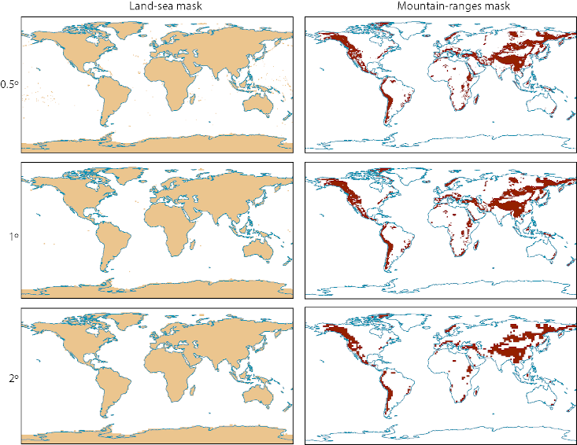

# Sets of reference grids

Several reference grids (with 0.5&deg; 1&deg;, and 2&deg; spatial resolution) are used in the Atlas to interpolate CORDEX, CMIP5 and CMIP6 ensembles to common regular grids (also 0.25&deg; for regional observations and EURO-CORDEX). Some datasets produced using these masks are:
* land sea masks: `land_sea_mask_*.nc4`
* mountain ranges masks: `mountain_ranges_mask_*.nc4`

A Jupyter notebook illustrating a simple example of their use in R is provided in [notebooks](./notebooks).
The figure below represents these masks for the 0.5&deg;, 1&deg;, and 2&deg; resolutions.

  

## Land-sea masks

### Medium- to low-resolution masks

The land-sea masks for the 0.5&deg;, 1&deg;, and 2&deg; grids are produced using the land-sea mask of the [WFDE5](https://essd.copernicus.org/articles/12/2097/2020/) dataset (ERA5 bias adjusted, file [ASurf_WFDE5_CRU_v1.1.nc](https://doi.org/10.24381/cds.20d54e34)). The coarser 1&deg; and 2&deg; grids are produced upscaling the 0.5&deg; grid and using a >0.5 threshold for land/sea ratio in the resulting gridboxes. The 0.25&deg; grid is obtained from the [ERA5](https://doi.org/10.24381/cds.adbb2d47) grid (land-sea mask), considering the same threshold (0.5) for land/sea ratio.

### High-resolution masks

The land-sea masks for the 0.03125&deg;, 0.0625&deg; and 0.125&deg; grids are produced using the regular 0.03125 degree longitude-latitude grids of the global orography and the land-sea mask generated by the geogrid software, part of the WRF Preprocessing System (https://github.com/wrf-model/WPS), version 4.1.1. The underlying data are based on 30-seconds data from the Global Multi-resolution Terrain Elevation Data (GMTED2010; https://www.usgs.gov/coastal-changes-and-impacts/gmted2010) and the 21-class MODIS land cover data (categories 17 and 21 set as water grid cells), using the default interpolation options. The coarser 0.0625&deg; and 0.125&deg; grids are produced upscaling the 0.03125&deg; grid and using a >0.5 threshold for land/sea ratio in the resulting gridboxes.

## Mountain-ranges masks
The mountain ranges masks (0.5&deg;, 1&deg;, and 2&deg;) have been defined using the K1 global mountains GIS datalayer ([USGS Land Change Science Global Ecosystems](https://rmgsc.cr.usgs.gov/outgoing/ecosystems/Global); file: `GlobalMountainsK1Binary.zip`; Kapos et al. 2000). The raster is based on 1 km DEM and has been upscaled to 0.5° using a 0.75 threshold for mountain area extent within the gridbox. The 2° and 1° masks are upscaled versions of the 0.5° grid considering a 0.5 threshold for mountain area extent within the gridbox to better match the mountain areas in the different resolution grids.

## Special masks
Includes auxiliary masks used to filter out gridboxes with no observational data (infilled with distintant station values) for different observational datasets used in the Interactive Atlas (http://interactive-atlas.ipcc.ch/regional-information).

### References
Kapos, V., J. Rhind, M. Edwards, M. Prince, and C. Ravilious (2000) Developing a map of the world’s mountain forests. In: M. Price and N. Butt (eds), Forests in Sustainable Mountain Development, IUFRO Research Series 5, CABI Publishing, Wallingford, UK; pp. 4-9.
