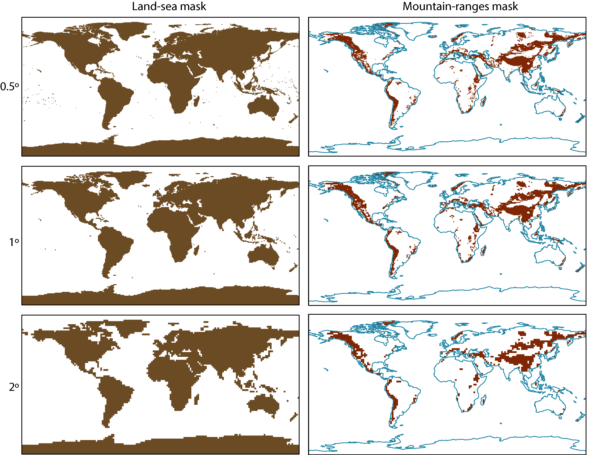

(reference-grids-md)=
# Sets of reference grids

Several reference grids (with 0.5&deg; 1&deg;, and 2&deg; spatial resolution) are used in the Atlas to interpolate CORDEX, CMIP5 and CMIP6 ensembles to common regular grids (also 0.25&deg; for regional observations and EURO-CORDEX). Some datasets produced using these masks are:
* land sea masks: `land_sea_mask_*.nc4`
* mountain ranges masks: `mountain_ranges_mask_*.nc4`

A Jupyter notebook illustrating a simple example of their use in R is provided in [notebooks](notebooks).
The figure below represents these masks for the 0.5&deg;, 1&deg;, and 2&deg; resolutions.

<p align="center">
  
</p>

## Land-sea masks
The land-sea masks for the 0.5&deg;, 1&deg;, and 2&deg; grids are produced using the land-sea mask of the {cite:authorpar}`ESSDWFDE5Biasadjusted` dataset (ERA5 bias adjusted, file {cite:authorpar}`SurfaceMeteorologicalVariables`). The coarser 1&deg; and 2&deg; grids are produced upscaling the 0.5&deg; grid and using a ≥0.5 threshold for land/sea ratio in the resulting gridboxes. The 0.25&deg; grid is obtained from the {cite:authorpar}`ERA5HourlyData` grid (land-sea mask), considering the same threshold (0.5) for land/sea ratio.

## Mountain-ranges masks
The mountain ranges masks (0.5&deg;, 1&deg;, and 2&deg;) have been defined using the K1 global mountains GIS datalayer ({cite:authorpar}`RmgscCrUsgs`; file: `GlobalMountainsK1Binary.zip`; Kapos et al. 2000). The raster is based on 1 km DEM and has been upscaled to 0.5° using a 0.75 threshold for mountain area extent within the gridbox. The 2° and 1° masks are upscaled versions of the 0.5° grid considering a 0.5 threshold for mountain area extent within the gridbox to better match the mountain areas in the different resolution grids.

## Special masks
Includes auxiliary masks used to filter out gridboxes with no observational data (infilled with distintant station values) for different observational datasets used in the Interactive Atlas {cite:authorpar}`IPCCWGIInteractive`.

### References

```{bibliography}
:filter: docname in docnames
```

{cite}`DevelopingMapWorld`


<script src="https://utteranc.es/client.js"
        repo="PhantomAurelia/Atlas"
        issue-term="pathname"
        theme="preferred-color-scheme"
        crossorigin="anonymous"
        async>
</script>