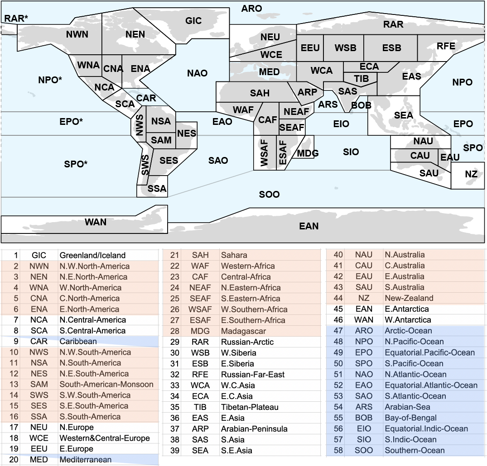

## Sets of regions for the ATLAS

Several alternative sets of regions are included to facilitate the regional synthesis of information:
* IPCC-WGI reference regions (land and mountain-range subregions are also defined using [masks](../reference-grids)) 
* IPCC-WGII continental regions
* Monsoon regions
* River basins
* Small islands
* Ocean biomes

Click on the geojson files to see the regions in an integrated viewer. 

### IPCC-WGI Reference Regions (version 4)

Different sets of climatic reference regions have been proposed for the regional synthesis of historical trends and future climate change projections, and have been subsequently used in the different Assessment Reports of the IPCC WGI (we refer to these sets as **IPCC-WGI reference regions**). The Giorgi reference regions (originally 23 rectangular regions proposed in [Giorgi and Francisco, 2000](https://doi.org/10.1007/PL00013733), denoted here as **version 1**) were used in the third (AR3) and fourth (AR4) IPCC Assessment reports. These regions were later modified using more flexible polygons in the IPCC SREX special report ([Seneviratne et al., 2012](https://www.ipcc.ch/site/assets/uploads/2018/03/SREX-Chap3_FINAL-1.pdf), **version 2**) and then slightly modified and extended to 33 regions (by including island states, the Arctic and Antarctica) for the fifth Assessment Report (AR5, [van Oldenborgh et al., 2013](https://www.ipcc.ch/report/ar5/wg1/atlas-of-global-and-regional-climate-projections), **version 3**). 

This repository includes technical and supplementary information for a recent update of these regions presented in https://doi.org/10.5194/essd-12-2959-2020 (referred to as **version 4 - v4**). The updated reference regions are provided as polygons in different formats (csv with coordinates, R data, and shapefile) together with R and Python notebooks illustrating the use of these regions with worked examples.

The csv file contains the corner coordinates defining each region in [EPSG:4326](https://spatialreference.org/ref/epsg/wgs-84/) and is used to build the spatial objects (the R data file and the shapefile), which contain coordinate information at a 0.44º resolution. This additional information is created via linear interpolation, while keeping the original vertices defined in the csv.

Spatially averaged results of CMIP5 and CMIP6 models (see [Atlas Hub inventory](https://github.com/SantanderMetGroup/IPCC-Atlas/tree/devel/AtlasHub-inventory), version 20191211) have been computed for the different reference regions and are available at the [*aggregated-datasets*](https://github.com/SantanderMetGroup/ATLAS/tree/devel/aggregated-datasets) folder. 

***
**NOTE**: Region acronyms followed by the `*` suffix in the csv file define the part of the polygon of the same name that extends beyond the 180º meridian (i.e. RAR, NPO, EPO and SPO). This distinction is not needed in the spatial objects (the R data object and the shapefile), as the regions separated by the 180º meridian are merged and considered as a single polygon.

### River basins

Comprises 28 major river basins filtered from the world bank data catalogue ([total of 254 basins](https://datacatalog.worldbank.org/dataset/major-river-basins-world)). This dataset was facilitated by Aristeidis Koutroulis (Technical University of Crete) and Richard Betts (Met Office Hadley Centre), as part of IPCC WGII activities. 

### Ocean biomes

Ocean regions or biomes as defined by [Gregor et al. (2019)](https://www.geosci-model-dev.net/12/5113/2019/), clustering and expanding the open ocean biomes defined by [Fay and McKinley (2014)](https://essd.copernicus.org/articles/6/273/2014/) on a 1° × 1° grid. The regions are: 
* Northern Hemisphere High Latitudes (NH-HL),
* Northern Hemisphere Subtropics (NH-ST),
* Equatorial (EQU) 
* Southern Hemisphere High Latitudes (SH-HL) 
* Southern Hemisphere Subtropics (SH-ST)
* Eastern Boundaries (EastBound)
* Amazon River (AmzOut)
* Gulf of Mexico (GulfMex)
* Arabian Sea (ArabSea) 
* Indonesian Flowthrough (IndoFlow)

