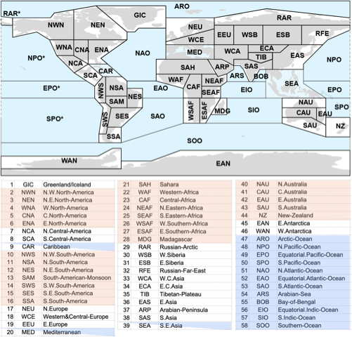

(reference-regions)=
# Sets of regions for regional synthesis

Several alternative sets of regions are included to facilitate the regional synthesis of information:

 * IPCC AR6 WGI reference regions (land and mountain-range subregions are also defined using masks under [reference-grids](reference-grids)) 
 * IPCC AR6 WGII continental regions
 * Monsoon regions
 * River basins
 * Small islands
 * Ocean biomes

These sets of regions can be displayed in an integrated viewer by clicking on the corresponding geojson files above. 

## AR6-WGI Reference Regions: IPCC-WGI Reference Regions version 4

Different sets of climatic reference regions have been proposed for the regional synthesis of historical trends and future climate change projections, and have been subsequently used in the different Assessment Reports of the IPCC WGI (we refer to these sets as **IPCC-WGI reference regions**). The 23 rectangular reference regions originally proposed in {cite:authorpar}`giorgiUncertaintiesRegionalClimate` (**version 1**) were used in the third (AR3) and fourth (AR4) IPCC Assessment reports. These regions were later modified using more flexible polygons in the IPCC SREX special report ({cite:authorpar}`seneviratneChangesClimateExtremes2012`, **version 2**) and then slightly modified and extended to 33 regions (by including island states, the Arctic and Antarctica) for the fifth Assessment Report (AR5, {cite:authorpar}`AtlasGlobalRegional`, **version 3**). 



This repository includes technical and supplementary information for a recent update of these regions presented in {cite}`iturbide_update_2020`, referred to as **version 4**, which is used in AR6-WGI (**AR6-WGI Reference Regions**). The updated reference regions are provided as polygons in different formats (CSV with coordinates, R data, shapefile and geojson) together with R and Python notebooks illustrating the use of these regions with worked examples.

The CSV file contains the corner coordinates defining each region in {cite:authorpar}`WGS84EPSG` and it is used to build the spatial objects (the R data file and the shapefile), which contain coordinate information at a 0.44º resolution. This additional information is created via linear interpolation, while keeping the original vertices defined in the CSV file. Note that, in the CSV file, region acronyms followed by the `*` suffix define the part of the polygon of the same name that extends beyond the 180º meridian (i.e. RAR, NPO, EPO and SPO). This distinction is not needed in the spatial objects (the R data object, shapefile and geojson), as the regions separated by the 180° meridian are merged and considered as a single polygon.

Spatially averaged output from CMIP5 and CMIP6 global climate models (see [data-sources](data-sources)) have been computed for the different reference regions and are available at the [datasets-aggregated-regionally](datasets-aggregated-regionally) folder.

## IPCC-WGII continental regions

Comprises eight continental regions used in the WGII report (Africa, Antarctica, Asia, Australasia, Central and South America, Europe, North America, and Small Islands).

## Monsoon regions

Comprises the six land monsoon regions defined in WGI Chapter 8 (Section 8.3.2.4, Figure 8.11): North American monsoon (NAmerM, Jul-Sep), West African monsoon (WAfriM, Jun-Sep), South and Southeast Asian monsoon (SAsiaM, Jun-Sep), East Asian monsoon (EAsiaM, Jun-Aug), South American monsoon (SAmerM, Dec-Feb), Australian and Maritime Continent monsoon (AusMCM, Dec-Feb).

## River basins

Comprises 28 major river basins filtered from the world bank data catalogue ({cite:authorpar}`MajorRiverBasins`). This dataset was facilitated by Aristeidis Koutroulis (Technical University of Crete) and Richard Betts (Met Office Hadley Centre), as part of IPCC WGII activities. 

## Small islands

Comprises nine small island regions used in the Atlas Chapter (Section Atlas.10; Figure Atlas.4):  North Indian Ocean (ARB and BOB), West Indian Ocean, Midway-Hawaian Islands, Northwest tropics, Equatorial Pacific, Northwest SPCZ, Southwest SPCZ, Southern subtropics and the Caribbean.

## Ocean biomes

Ocean regions or biomes as defined by {cite:authorpar}`gregorComparativeAssessmentUncertainties2019`, clustering and expanding the open ocean biomes defined by {cite:authorpar}`fayGlobalOpenoceanBiomes2014` on a 1° × 1° grid. The regions are: 
* Northern Hemisphere High Latitudes (NH-HL),
* Northern Hemisphere Subtropics (NH-ST),
* Equatorial (EQU) 
* Southern Hemisphere High Latitudes (SH-HL) 
* Southern Hemisphere Subtropics (SH-ST)
* Eastern Boundaries (EastBound)
* Amazon River (AmzOut)
* Gulf of Mexico (GulfMex)
* Arabian Sea (ArabSea) 
* Indonesian Flowthrough (IndoFlow)


### References

```{bibliography}
:filter: docname in docnames
```

<script src="https://utteranc.es/client.js"
        repo="PhantomAurelia/Atlas"
        issue-term="pathname"
        theme="preferred-color-scheme"
        crossorigin="anonymous"
        async>
</script>