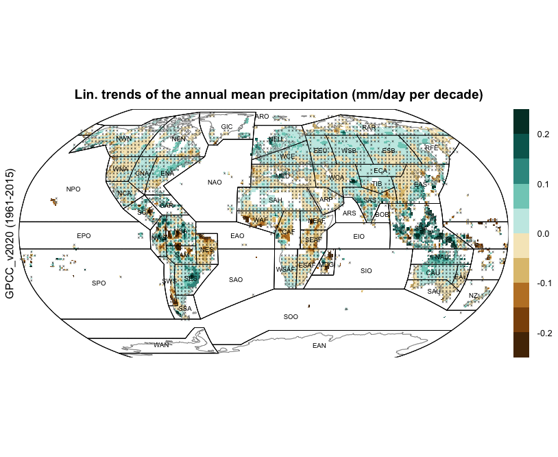
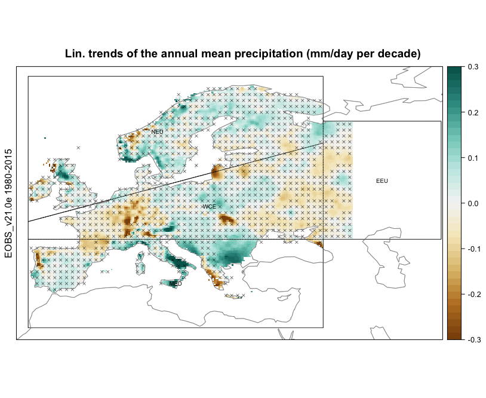
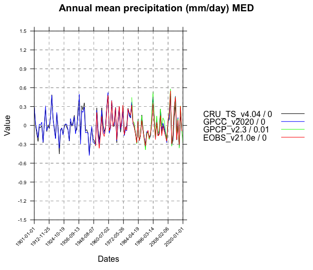
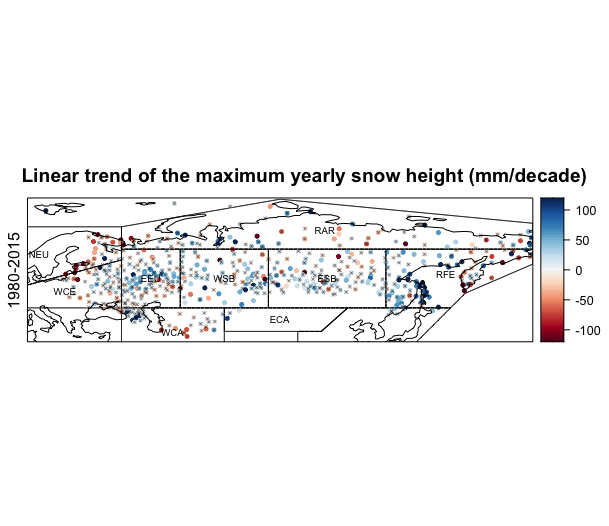

(observations)=
# Code for reproducibility of the ATLAS spatial maps of the observed linear trends  

The ATLAS chapter of the IPCC report contains maps which show the observed linear trends for certain variables of interest, at both continental and global scales. We provide a set of scripts used to generate these trends for  mean annual precipitation, air surface temperature, snow duration and maximum snow height. 

* `observationsTrendsGlobal.R`: This script aims to compute the linear trends (rate of change per decade) for the mean annual precipitation and air surface temperature for global observational datasets. We also calculate the p-values associated to these trends, ---in order to measure their statistical significance based on a significane level of 0.1,--- and use hatching to incorporate this information in the spatial plots (i.e., hatching whenever p-value >= 0.1). 
* `observationsTrendsEurope.R`: This script aims to compute the linear trends (rate of change per decade) for the mean annual precipitation and air surface temperature for the E-OBS dataset over Europe. We also calculate the p-values associated to these trends, ---in order to measure their statistical significance based on a significane level of 0.1,--- and use hatching to incorporate this information in the spatial plots (i.e., hatching whenever p-value >= 0.1). 
* `observationsTrendsSnow.R`: This script aims to compute the linear trends (rate of change per decade) for 1) the maximum yearly snow height, and 2) the snow duration, over a large area of the European and Asian continent (former USSR territories) for the period 1980-2015. The latter metric is computed separately for the two halfs of the year  (Jan-Jun, Jul-Dec). We use the observational dataset Roshydromet, which consists of a set of temporal records at station-scale, most of them appearing in the Global Climate Observation Network. 

In addition, we also provide a script that reproduces the temporal series of the yearly anomalies of precipitation and air surface temperature over the European IPCC regions, also appearing in the IPCC report. 
* `observationsSeriesEurope.R`: This script aims to compute the temporal series of the yearly anomalies of precipitation and air surface temperature. We build on four observational datasets for each of the two variables of interest, and show the series obtained for the four European IPCC regions. Moreover, we include in these temporal plots the linear trends of these series for each of the variables, datasets and regions.

We build on [climate4R](https://github.com/SantanderMetGroup/climate4R), an R framework for climate data access and post-processing.
These scripts are flexible and easy to use. Most of them allow for a flexible selection of some parameters which include:

* Variable
* Dataset(s)
* Temporal period
* Spatial domain
* Graphical parameters

For example, the following parameter configuration in `observationsTrendsGlobal.R`,

```r
datasets <- "GPCC_v2020"
# select the variable (prcptot = "total precipitation")
var <-  "prcptot"
# Graphical parameters
colorScale_trends <- seq(-0.25, 0.25, length.out = 11) 
colorPalette <- brewer.pal(n = 10, "BrBG") %>% colorRampPalette() 
title <- "Lin. trends of the annual mean precipitation (mm/day per decade)" 
d <- 4
```

Will result in the following spatial plot:




Following this idea, for a particular parameter configuration in `observationsTrendsEurope.R`

```r
dataset <- "EOBS_v21.0e" 
# select the variable (prcptot = "total precipitation")
var <-  "prcptot"
# select the temporal period
years <- list(1980:2015,"1980-2015")
# select the spatial domain
latLim <- c(28,74) ; lonLim <- c(-12,60) # Europe
# Graphical parameters
colorScale_trends <- seq(-0.3, 0.3, 0.015) 
colorPalette <- brewer.pal(n = 9, "BrBG") %>% colorRampPalette() 
title <- "Lin. trends of the annual mean precipitation (mm/day per decade)" 
```

We will obtain the following spatial plot, which shows linear trends for annual mean precipitation over Europe:




The latter spatial plot is accompanied by temporal series of four observational datasets, which can be obtained in `observationsSeriesEurope.R`. We show the case for the MED European IPCC region, by setting the following parameter configuration:

```r
datasets <- c("CRU_TS_v4.04","GPCC_v2020","GPCP_v2.3","EOBS_v21.0e")
# select the variable (prcptot = "total precipitation")
var <-  "prcptot"
# select the temporal period
years <- list(1901:2019,1901:2019,1979:2020,1950:2019)
# select the spatial domain
latLim <- c(28,74) ; lonLim <- c(-12,60) # Europe
# Graphical parameters
cols <- c("black","blue","green","red")
title <- "Annual mean precipitation (mm/day)"
ylim <- c(-1.5,1.5)
```

Resulting in the following series:




The script `observationsTrendsSnow.R` provide, for instance, the following figure:





<script src="https://utteranc.es/client.js"
        repo="PhantomAurelia/Atlas"
        issue-term="pathname"
        theme="preferred-color-scheme"
        crossorigin="anonymous"
        async>
</script>