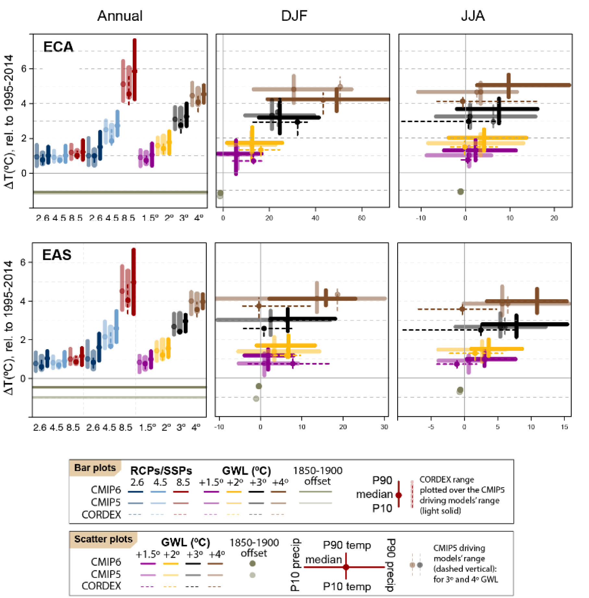

(projections)=
# Code for reproducibility of the ATLAS boxplots and scatterplots of model projections

´´´sh reproducibility/projections/boxplots_TandP.R ''' is the star script of the ATLAS!!

It is flexible and easy to use. There is no special requirements for executing the script (only an R environment with a few packages), as it uses R functions and data stored in this repository. 

The R function used is computeFigures (available at '''sh ./datasets/aggregated-regionally/scripts/computeFigures.R''') and the data used are the regional means available at '''sh ./datasets-aggregated-regionally/data/ '''.

It allows for the selection of:

* Seasons
* Reference period
* Surface (Land, sea or both)
* Region/s from the '''sh ./reference-regions/''' {cite}`iturbide_update_2020`.

For example, the following parameter configuration,

```r
# select seasons, use c(12,1,2) for winter
scatter.seasons <- list(c(12, 1, 2), 6:8)
# select reference period
ref.period <- 1995:2014
# select the area, i.e. "land", "sea" or "landsea"
area <- "land"
# Select reference regions.  Select the CORDEX domain to be considered
regions <- c("ECA", "EAS"); cordex.domain <- "EAS"
```

Will result in the following boxplots and scatterplots:




## References

```{bibliography}
:filter: docname in docnames
```

<script src="https://utteranc.es/client.js"
        repo="PhantomAurelia/Atlas"
        issue-term="pathname"
        theme="preferred-color-scheme"
        crossorigin="anonymous"
        async>
</script>